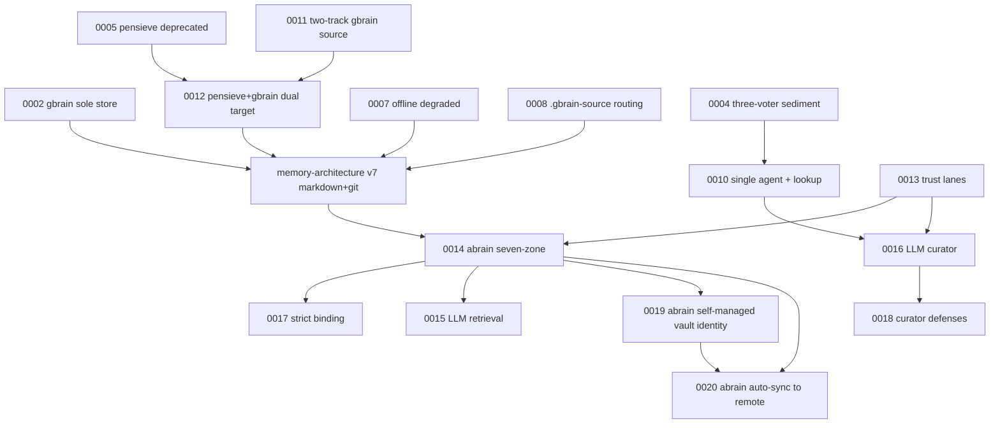

# ADR Index — current truth quick reference

本文解决一个问题：18 个编号 ADR 记录了多次架构转向，不能按编号顺序直接当 current spec 读。阅读 current 实现请先看 `docs/current-state.md` 与 `docs/architecture/`；ADR 用来理解“为什么走到现在”。

物理组织：current/半有效 ADR 留在本目录；完全历史化的 7 篇原文移到 [archive/](./archive/)。不保留 stub；引用方应直接链接到 archive 路径。

## 1. 先读这些（当前设计真相）

| ADR | 状态 | 为什么重要 |
|---|---|---|
| [0014 Abrain as Personal Brain](./0014-abrain-as-personal-brain.md) | Accepted | `~/.abrain` 七区、数字孪生定位、Lane A/C/G/V、`.pensieve` 退场方向。 |
| [0015 Memory Search LLM Retrieval](./0015-memory-search-llm-driven-retrieval.md) | Accepted | `memory_search` 双阶段 LLM retrieval；hard error，无 grep fallback。 |
| [0016 Sediment as LLM Curator](./0016-sediment-as-llm-curator.md) | Accepted | 从 gate-heavy extractor 转为 LLM curator；删除大部分机械 gate。 |
| [0017 Project Binding Strict Mode](./0017-project-binding-strict-mode.md) | Accepted | `.abrain-project.json` + `_project.json` + local-map 三件套。 |
| [0018 Curator Defense Layers](./0018-sediment-curator-defense-layers.md) | Accepted with partial revert | Layer 1 prompt discipline + trigger phrase preservation；body shrink/section loss gates 已历史化。 |
| [0019 Abrain Self-Managed Vault Identity](./0019-abrain-self-managed-vault-identity.md) | Accepted | abrain 自管 age keypair 为 Tier 1 vault backend；ssh-key/gpg-file/passphrase-only 降为 Tier 3 explicit-only；detection 末档 disabled。取代 v1.4 vault-bootstrap §1 的跨设备同步假设。 |
| [0020 Abrain Auto-Sync to Remote](./0020-abrain-auto-sync-to-remote.md) | Accepted | sediment commit 后后台 push + pi 启动 ff-only fetch；跨设备知识同步。冲突不自动 merge（LLM auto-merge 被明确拒绝），提示用户手动解决。`/abrain sync` + `/abrain status` slash commands。 |

## 2. 仍有基础价值但主体部分过时

| ADR | 当前读法 |
|---|---|
| [0001 pi-astack as personal pi workflow](./0001-pi-astack-as-personal-pi-workflow.md) | 项目定位、使用即开发、vendor+端口层、硬纪律仍有价值；记忆基础设施段落以 current docs 为准。 |
| [0003 Main Session Read-only](./0003-main-session-read-only.md) | “主会话只读 / sediment 单写”仍是核心不变量；旧 bash regex、pg role、gbrain guard 实现已过时。 |
| [0006 Component Consolidation](./0006-component-consolidation.md) | 三分类（A 自有 / B vendor / C 内部迁入）仍有价值；具体路径以 `UPSTREAM.md` 和 directory layout 为准。 |
| [0009 Multi-agent as Base Capability](./0009-multi-agent-as-base-capability.md) | dispatch 作为基础能力仍真；旧 `multi_dispatch`/templates/`extensions/multi-agent` 是历史设计。 |
| [0010 Sediment Single-agent with Lookup Tools](./0010-sediment-single-agent-with-lookup-tools.md) | 单 agent kernel 被 0016 继承；markdown terminator/gbrain 技术细节过时。 |
| [0013 Asymmetric Trust Three Lanes](./0013-asymmetric-trust-three-lanes.md) | trust × blast radius 思想仍有价值；Lane B/D 被 0014 废止，Lane C 机械 gates 被 0016 删除。 |

## 3. 历史归档：不要实施主体设计

这些 ADR 的原文已移入 [archive/](./archive/)；下表直接链接到 archive 原文。

| ADR | 为什么保留 |
|---|---|
| [0002 gbrain as sole memory store](./archive/0002-gbrain-as-sole-memory-store.md) | 记录 gbrain 时代的最初假设；已被 markdown+git 取代。 |
| [0004 Sediment write strategy](./archive/0004-sediment-write-strategy.md) | 三模型投票失败的前史；部分安全 rubric 被后续 prompt/sanitizer 吸收。 |
| [0005 Pensieve deprecated](./archive/0005-pensieve-deprecated.md) | 外部 Pensieve 组件退场的历史；project memory 当前位置见 ADR 0014/0017。 |
| [0007 Offline degraded mode](./archive/0007-offline-degraded-mode.md) | gbrain offline 成本分析；markdown+git 后前提失效。 |
| [0008 pi dotfiles dual role](./archive/0008-pi-dotfiles-dual-role.md) | `.gbrain-source` 路由历史；strict binding 已取代。 |
| [0011 Sediment two-track pipeline](./archive/0011-sediment-two-track-pipeline.md) | gbrain multi-source 尝试；已失效。 |
| [0012 Pensieve+gbrain dual target](./archive/0012-sediment-pensieve-gbrain-dual-target.md) | gbrain v0.27 multi-source 不可用的源码取证；设计已被 v7/v7.1 取代。 |

## 4. Supersede / evolution graph

## 5. 状态术语

- **Accepted**：主体仍是 current decision。
- **Accepted with partial supersede/revert**：核心仍有效，但部分机制被后续 ADR 或实现取代。
- **Evolved**：思想被后续 ADR 继承，原技术细节不再实施。
- **Superseded/Historical**：保留为设计档案，不应作为实现依据。

## 6. 推荐阅读顺序

1. `docs/current-state.md`
2. `docs/architecture/overview.md`
3. ADR 0014 → 0017 → 0019 → 0020 → 0015 → 0016 → 0018
4. 需要理解前史时再读 0001/0003/0006/0009/0010/0013
5. 只有做考古/审计时才读 archive 原文：0002/0004/0005/0007/0008/0011/0012
